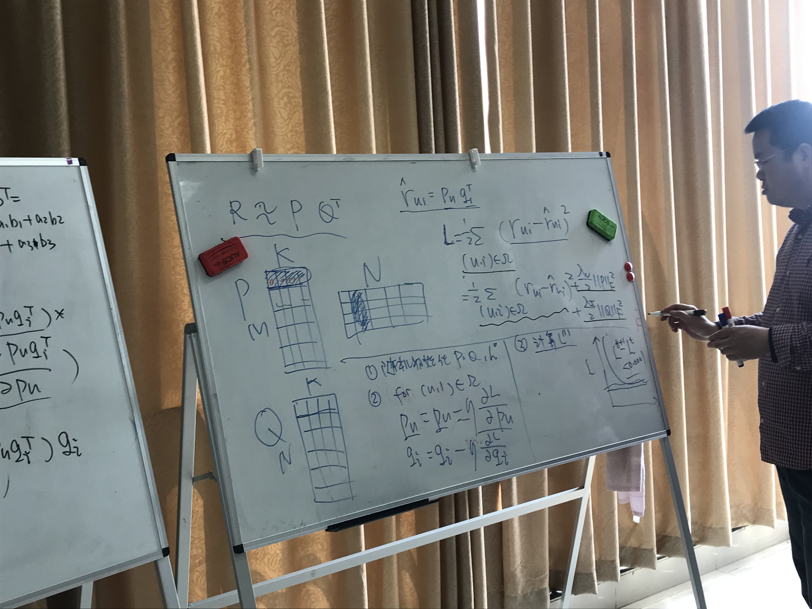
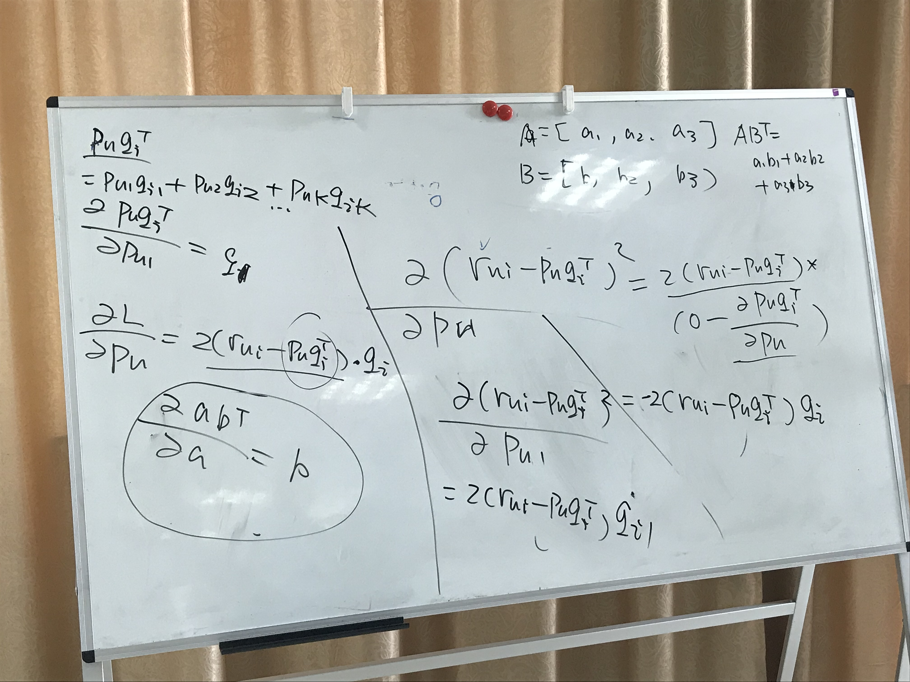
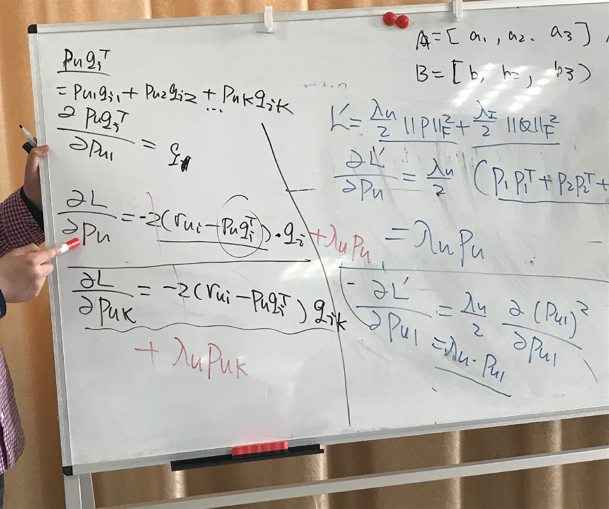
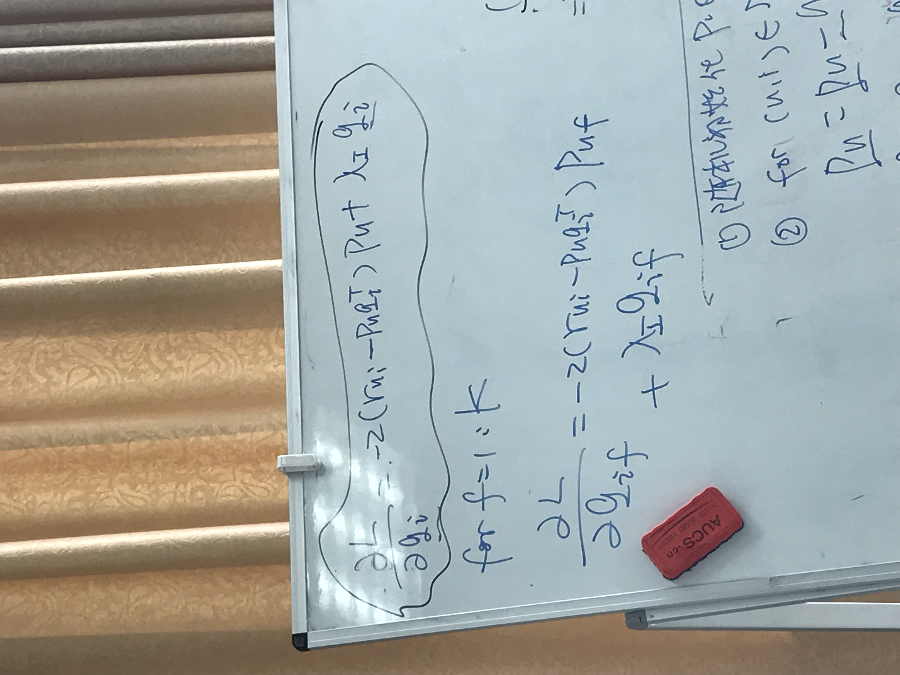

[TOC]

# 推荐算法MF听课笔记

## MF算法流程

1. 原理：将m\*n的矩阵用m\*k的矩阵和n\*k的矩阵的转置表示

2. 表示之后计算误差，进行梯度下降，加入正则化式子防止过拟合化

3. 结果：

	  1. 总式子：



  2. 中间运算公式：



  3. 最终算法结果（上）和伪代码（下）：




4. 代码：

	```python
	#!/usr/bin/python
	#
	# Created by Albert Au Yeung (2010)
	#
	# An implementation of matrix factorization
	#
	try:
	    import numpy
	except:
	    print( "This implementation requires the numpy module.")
	    exit(0)
	
	###############################################################################
	
	"""
	@INPUT:
	    R     : a matrix to be factorized, dimension N x M
	    P     : an initial matrix of dimension N x K
	    Q     : an initial matrix of dimension M x K
	    K     : the number of latent features
	    steps : the maximum number of steps to perform the optimisation
	    alpha : the learning rate
	    beta  : the regularization parameter
	@OUTPUT:
	    the final matrices P and Q
	"""
	def matrix_factorization(R, P, Q, K, steps=5000, alpha=0.0002, beta=0.02):
	    Q = Q.T
	    for step in range(steps):
	        for i in range(len(R)):
	            for j in range(len(R[i])):
	                if R[i][j] > 0:
	                    eij = R[i][j] - numpy.dot(P[i,:],Q[:,j])
	                    for k in range(K):
	                        P[i][k] = P[i][k] + alpha * (2 * eij * Q[k][j] - beta * P[i][k])
	                        Q[k][j] = Q[k][j] + alpha * (2 * eij * P[i][k] - beta * Q[k][j])
	        eR = numpy.dot(P,Q)
	        e = 0
	        for i in range(len(R)):
	            for j in range(len(R[i])):
	                if R[i][j] > 0:
	                    e = e + pow(R[i][j] - numpy.dot(P[i,:],Q[:,j]), 2)
	                    for k in range(K):
	                        e = e + (beta/2) * ( pow(P[i][k],2) + pow(Q[k][j],2) )
	        if e < 0.001:
	            break
	    return P, Q.T
	
	################################################################
	# ###############
	
	if __name__ == "__main__":
	    R = [
	         [5,3,0,1],
	         [4,0,0,1],
	         [1,1,0,5],
	         [1,0,0,4],
	         [0,1,5,4],
	        ]
	
	    R = numpy.array(R)
	    N = len(R)
	    M = len(R[0])
	    K = 2
	
	    P = numpy.random.rand(N,K)
	    Q = numpy.random.rand(M,K)
	
	    nP, nQ = matrix_factorization(R, P, Q, K)
	    print(nP)
	    print(nQ)
	```

5. 

## numpy使用

1. 将文件加载为矩阵

  ```python
  numpy.loadtxt("路径")
  ```

2. 删除矩阵列或行

  ```python
  numpy.delete(矩阵名,行或列下标,0或1)		#0表示行，1表示列
  ```

3. 创建新矩阵

	```python
	numpy.array(list格式数据)		#使用list格式的数据生成相应行列的矩阵
	```

4. 

5. 

