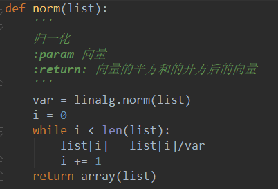
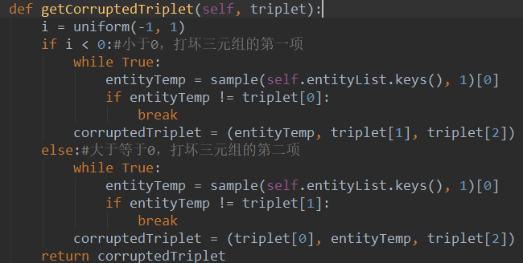

代码提供者给出的一些对原理图的解释:

图上的加号是大于0取原值，小于0则为0。我们叫做合页损失函数(hinge loss function)，这种训练方法叫做margin-based ranking criterion。就是来自SVM。支持向量机也是如此，要将正和负尽可能分开，找出最大距离的支持向量。同理，TransE也是如此，我们尽可能将对的和错的分开。margin值一般设为1了。

 

对距离的定义:

1. 初始化变量、处理变量

初始化并且归一化实体、关系列表

 

注：其中的norm函数由自己封装，其作用是每一项除以整个list的范数

 

2. 训练切片

训练20组，一组150个。

构造Tbatch用来存储打碎的三元组

对应切片中每一个元素来说，通过getCorruptedTriplet随机打碎第一项或者第二项

注：其中getCorruptedTriplet函数自己封装，功能是随机打碎第一项或第二项 !

在打碎后，若Tbatch中不存在，则添加进去。全部遍历结束后，更新并且写入文件。

3. 更新变量

首先，拷贝实体、关系列表。分别在Tbatch中取出h1、t1、r、h2、t2，取出原本的三元组中的h1、t1、r、h2、t2

然后，根据L1或者L2方式进行计算

注：其中函数定义，类似于mae和rmse

然后，更新计算loss函数,

distanceL2为欧几里得距离,由于求根会增加运算,所以保留平方

distanceL1 为哈夫曼距离

关于loss的SGD方程的推导:

对于TransE中的损失函数，首先进行简化，去掉[]+和前面的两个sigma求和，简化成如下形式。

f(h,l,t,h’,t’)=(d(h+l-t)+d(h’+l-t’))注意这里面的五个参数都是向量，那么对h求偏导，

我们看目标函数，把h视为向量时，d(h+l-t)=h+l-t。把h视为[x1,x2,x3,...,xn]这样的n个一维变量时，当距离函数即d函数采用L1范式，即曼哈顿距离，d函数可以进一步推导：

d(h+l-t)=fabs(h+l-t).sum()

假设h+l-t=[1,-2,3,-4]，那么d=1+2+3+4=10

所以我们推出：

根据公式进行变量更新

此项推导在代码中实现

 

注:

对于数据集大的情况下，有速度。因为参数之间并没有依赖或冲突,所以每次不需要都归一化处理.

全部更新完一次后，覆盖原来的实体、关系列表

