TransH的优势:

尽管TransE在知识表示的引用中因为其简单，高效,但是其也存在一定的缺陷。例如在处理

 

**自反关系，以及一对多、多对一、多对多关系**时存在一些不足。

1.初始化三元组

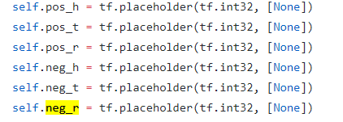

pos_h,pos_t,pos_r 代表正确的三元组: (h,r,t) 

neg_h,neg_t,neg_r 代表错误的三元组: (h’,r’,t’)

 

2.随机初始化embeding矩阵:

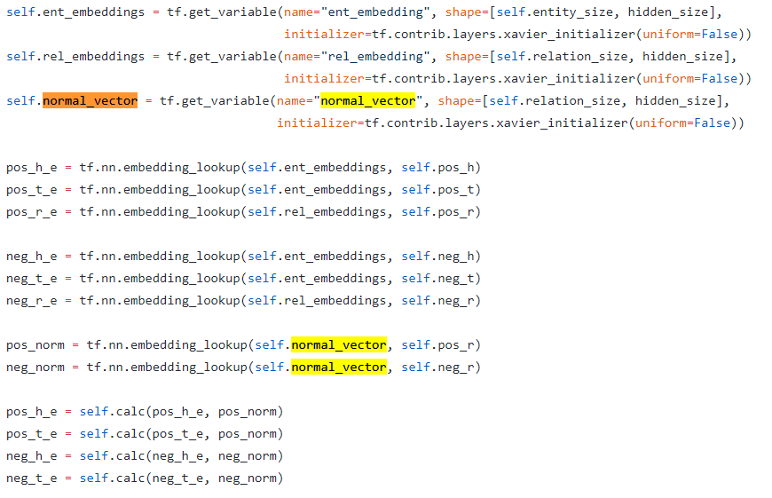

 

注:Pos_norm:表示每个正确三元组的平面法向量.

Neg_norm:表示每个错误的三元组的平面法向量

由于平面计算会带来复杂度,我们这里把平面特征用它的平面法向量来代替.

并且没个三元组都需要平面法向量

 

3.获得实体在平面上的投影

根据论文所给思路,TransH将头实体和尾实体投影到一个超平面上 

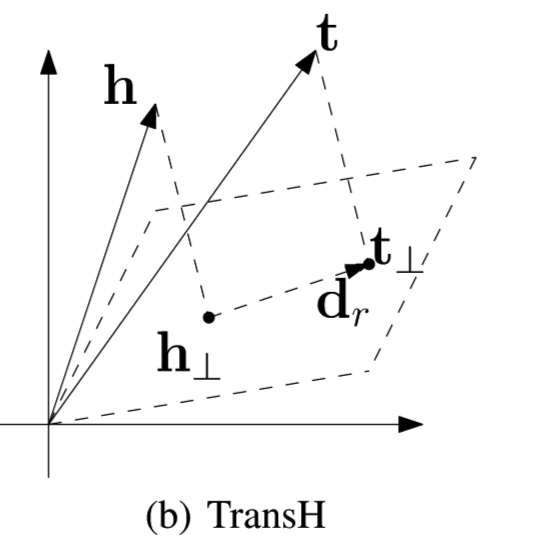

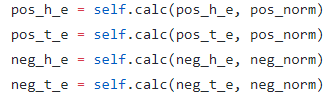

根据论文所给公式:

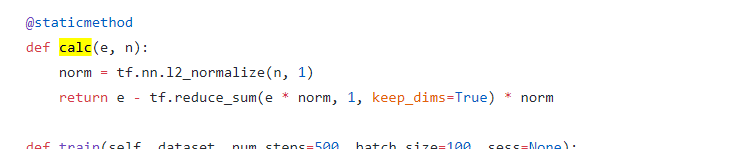

 

Calc对应论文中的公式:

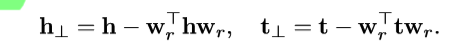

 

e 为 h , norm则为上文提到的平面法向量.

注:TransH的代码最大的特点就是不再使用简单的向量相加,即TransE.而是多了一步将实体h和实体t 改变为h,t的在超平面上的投影向量.

 

 

 

 

 

 

 

4.根据向量加法公式,我们可以得到判断距离的公式:

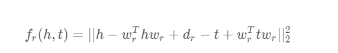

 

 

 

5.TransH的打碎过程

 

​       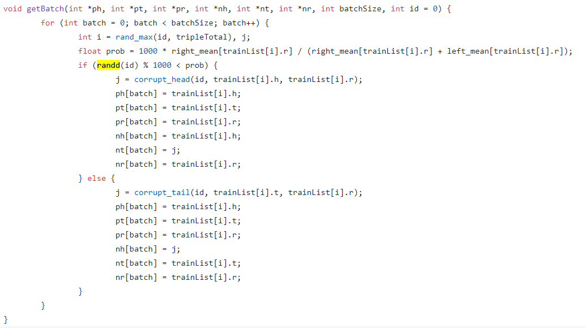

 

TransH的打碎过程如图,打碎函数使用的是c++代码.给我们的问题便是根据哪一个准则打碎,在这里,我们使用如下准则:

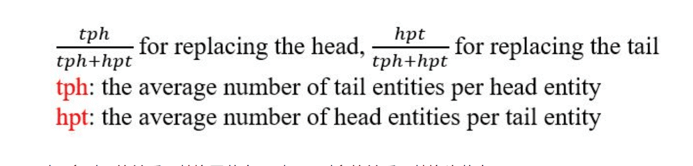

对应到代码的中则是:

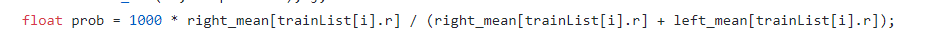

 

类似于TransE的打碎过程,通过prob于id的比较来决定替换头还是尾.最后将已经打碎的切片统一返回到TransR的代码当中.

 

梯度下降:

梯度下降的推导公式

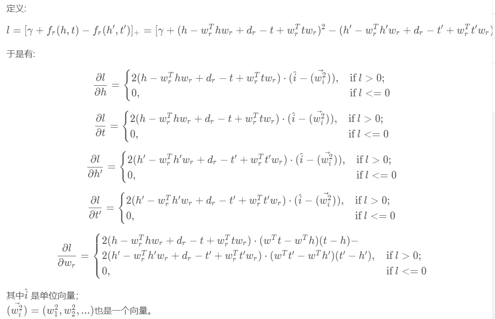

Tensoflow的梯度下降不需要手动推导,具体代码如下:

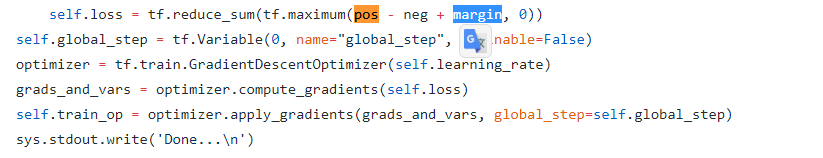