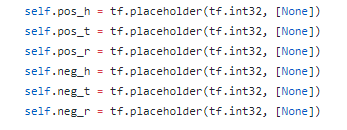
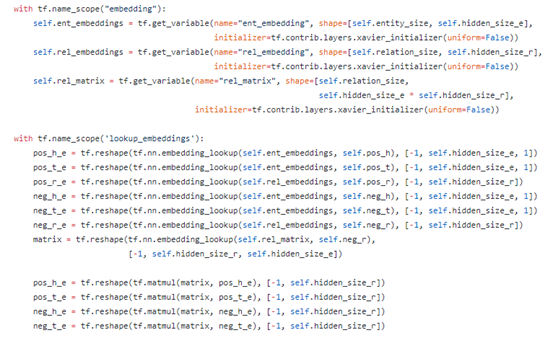
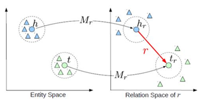
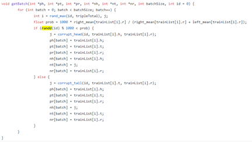
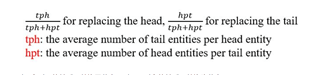
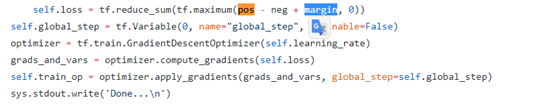

# TransR

TransE和TransH都假设实体和关系嵌入在相同的空间R~k~中。然而，一个实体是多种属性的综合体，不同关系关注实体的不同属性。直觉上一些相似的实体在实体空间中应该彼此靠近，但是同样地，在一些特定的不同的方面在对应的关系空间中应该彼此远离。为了解决这个问题，我们提出了一种新的方法，将实体和关系投影到不同的空间中，也就是实体空间和多元关系空间（也即是特定关系的实体空间），在对应的关系空间上实现翻译。因此命名为TransR。

1. 初始化三元组

	

	> pos_h,pos_t,pos_r 代表正确的三元组: (h,r,t) 
	>
	> neg_h,neg_t,neg_r 代表错误的三元组: (h’,r’,t’)

2. 随机初始化embeding矩阵:

> 这里使用的是利用矩阵乘法，将各个关系映射映射到不同的关系空间。

3. 获得实体在关系空间上的映射

> 对于每个元组（h，r，t），首先将实体空间中的实体通过$M_r$向关系r投影得到$h_r$和$t_r$，然后使$h_r+r≈t_r$

> matrix对应公式中的$M_r$:$h_r=hM_r$、$t_r=tM_r$

对于每个关系，有一个变换矩阵Mr和一个在它自己的关系空间的表示向量r。通过变换矩阵将前件和后件的表示向量映射到关系空间

再在关系空间通过训练使得hr+r≈tr。目标函数和训练方法和TransE模型一模一样

注:TransR的代码最大的特点就是不再使用简单的向量相加,即TransE.而是多了一步将实体h和实体t 改变为h,t的在关系平面上的投影向量.

4. 和transh一样，对距离公式进行改进:$f_r(h,t)=||h_r+r-t_r||^2_2$ ，loss函数同transe，为$\sum_{(h,r,t)\in S}\sum_{(h,r,t)\in S'}max(0,f_r(h,t)+r-f_r(h',t'))$

5. TransR的打碎过程

	

6. TransR的打碎过程同Transh,如图,打碎函数使用的是c++代码.给我们的问题便是根据哪一个准则打碎,在这里,我们使用如下准则:

	

	对应到代码的中则是

	

	类似于TransE的打碎过程,通过prob于id的比较来决定替换头还是尾.最后将已经打碎的切片统一返回到TransR的代码当中.

7. 梯度下降:

	梯度下降的推导公式：$L=\sum_{(h,r,t)\in S}\sum_{(h,r,t)\in S'}max(0,f_r(h,t)+r-f_r(h',t'))$

	Tensoflow的梯度下降不需要手动推导,具体代码如下:

	